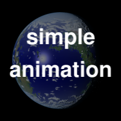
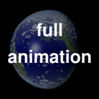

# animateIMG(3)

## Name

`animateIMG` - display animated image sequence with javascript

## Synopsis

``

`function animateIMG(` _srcList_`,` _params_ `);`

## Description

This function takes a sequence of images and produces an animation by
displaying them in succession within a specified `` element.  The
images are specified by an array of strings _srcList_ that will be
loaded and then displayed in the frame.  The _params_ object is a
structure whose members control the placement and other properties of
the animation.

For instance, if you have assigned the `` element an `id`
attribute, then you may set _params_`.imgID` to that value in order to
display the animation in that element.  Alternatively, if you have the
frame element object in the HTML Document Object Model, then you can
assign _params_`.img` to that object, which takes precedence over the
_params_.`imgID` field.

By default, the animation loops indefinitely, but can be paused by
clicking in the frame.  Other _params_ fields can modify this
behaviour: see below.

Additionally, you can give the animation a "control panel" by pointing
it to a container element (usually a `
` element), either by
assigning its `id` property to _params_`.panelID`, or the HTML DOM
element itself to _params_`.panel`.  The panel must be a positioned
element (i.e. have an explicit non-static `position:` property in its
style), and must have a width of more than 124 pixels wide at the time
the animation starts; otherwise `animateIMG` reverts to a plain
unadorned animation.

It is common to place the image element within the panel element, so
that the controls overlay the animation.  Setting the _params_`.hide`
parameter will cause the controls to display only when you mouse over
the panel.

The animation will inherit any styling associated with the ``
element, such as explicit dimensions.  It is also common to initialize
the `` tag with a "preview" image to display while the animation
is loading: that image will be replaced with the animation once all
animation frames have been loaded.

### Parameters: Plain Animation

The following parameters are used when displaying an animation without
a control panel.  As noted, only _srcList_ and one of _params_`.img`
or _params_`.imgID` are required; the rest are optional (with the
specified defaults).

    Parameter         Type     Description
    ----------------------------------------------------------------
    srcList           array    Array of image src strings  
    params.img        element  element to contain animation 
    params.imgID      string   ID of element to contain animation
    params.paused     boolean  Whether initially paused (false)
    params.clickable  boolean  Whether clicking frame pauses (true)
    params.cadence    number   Time in ms between frames (40)
    params.loopcount  number   # of times animation will play (0)

Note that a non-positive _params_`.loopcount=0` means the animation
will loop indefinitely.  Once the animation reaches its designated
loopcount, it will pause; if _params_`.clickable` is true then
clicking at the end of a loop sequence will start a new sequence.  If
_params_`.clickable` is `false` then _params_`.paused` is ignored,
unless the animation has a control panel (below).

### Parameters: Animation With Control Panel

When a control panel is present, the user can toggle whether the
animation loops or not.  The _params_`.loopcount` property is ignored
except to set the initial state of the looping toggle: "off" if
_params_`.loopcount` is 1, "on" if it is anything else.  The following
additional parameters are used, though only one of
_params_`.container` or _params_`.containerID` is required.

    Parameter         Type     Description
    ----------------------------------------------------------------
    params.panel      element  Element to place controls
    params.panelID    string   ID of element to place controls
    parame.icons      string   directory containing button icons (.)
    params.speedup    number   Frame stride in fast-forward (5)
    parame.hidden     boolean  Show panel only when hovering (false)

### Installing

To use animations, simply place the `animateimg.js` in a
browser-accessible directory, note its URL, and load it in pages using
a `` element.  Animations with control
panels also need button icons; see the **Files** section, below.

The `animateimg.js` file also contains the source code documentation,
including this document.  Running `bash animateimg.js > README.md`
will extract the (markdown-formatted) documentation.  The
`README.html` demo page and `animateIMG.3` Unix manpage included with
this distribution were generated from the `README.md` using standard
converters.

## Return Value

If `animateIMG` encounters an error parsing _params_, then it returns
`undefined`.  Otherwise, it returns an object containing several state
parameters and methods for interacting with the animation.  Normally
this can be ignored unless you plan to write additional javascript
code or handlers to interact with the animation.  The returned object
has the the following properties:

    Property   Type      Description
    ----------------------------------------------------------------
    max        number    Total number of frames to be displayed
    count      number    Current frame displayed
    paused     boolean   Whether currently paused
    loop       boolean   Whether currently set to loop
    loopcount  number    Requested number of loops (rounded)
    loopno     number    Current loop number
    stride     number    Current frame stride
    speedup    number    Frame stride to be used in fast-forward
    cadence    number    Current time in ms between frames
    play()     function  Run animation
    pause()    function  Pause/stop animation
    seek(n)    function  Jump to frame n
    reset()    function  Restore to state before calling animation

## Files

The default buttons and other icons for the control panel are given in
the `icons` subdirectory of this distribution, and are linked below;
note that most are pure white PNGs with variable opacity, intended to
be viewed on a dark background (such as the `back.png` image used in
the control panel).  If you are viewing this documentation as
`README.md` on GitHub, the icons below will be nearly invisible
white-on-white.  Cloning the repository and viewing `README.html` will
show the icons properly, and also display the demo animations in the
**Example** section.

You will likely want to copy these icons to a suitable
browser-viewable directory.  The URL of the icon directory can be
specified per-animation basis with the _params_`.icons` parameter.  If
_params_`.icons` is not specified, the animation will use a default
global variable declared in `animateimg.js`:

    var animateimg_default_icons = "";

You may edit this as necessary for your own installation.  A value of
"" means that `animateIMG` will look for icons in the same directory
as the page being viewed; relative URLs are also possible.  You may
also create your own icons, either globally or on a per-page or
per-animation basis.

## Notes

The function will replace the image element, and set the `onmouseover`
and `onmouseout` properties of the control panel element.  These are
saved and restored if the returned object's `reset()` method is
called.  Other properties of this element are left unchanged.  The
animation will *not* inherit the size of the container; use the
_params_`.imclass` parameter to apply styles to the animation images.

If _srcList_ contains only a single entry, then `animateIMG` does not
perform any animation; it simply replaces the image with that frame.
In this case the returned object contains only a single property, the
`reset()` method, which restores the original image.

## Example

The following HTML snippet loads the `animateIMG()` function, and also
places the images `example/image_1.png` through
`example/image_250.png` into the array `imglist`:

    
    

The default (looping, click-to-pause) animation simply places these
images into a specified `` element, which may or may not already
have a "preview" image::

    
    

To give the animation a full set of controls, specify a positioned
container with a known or calculable width (e.g. a `
` or `<td>`
element , not a `` element).  This container may include the
animation itsel, in which case it is convenient to show the controls
only when hovering with the mouse.  Be sure to give it a non-static
`position:` style; a `
` may also need to be specified with
`display: inline-block;` to allow it to resize according to its
contents.  E.g.

    

    

Although they display the same set of images, the two animations run
in separate `` elements, and the two calls to `animateIMG` create
separate instances of the underlying objects.  Thus, the animations
run completely independently of one another.

## See Also

[W3Schools](http://www.w3schools.com)

